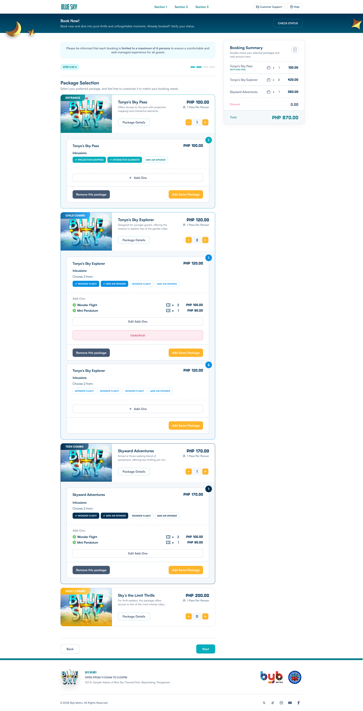
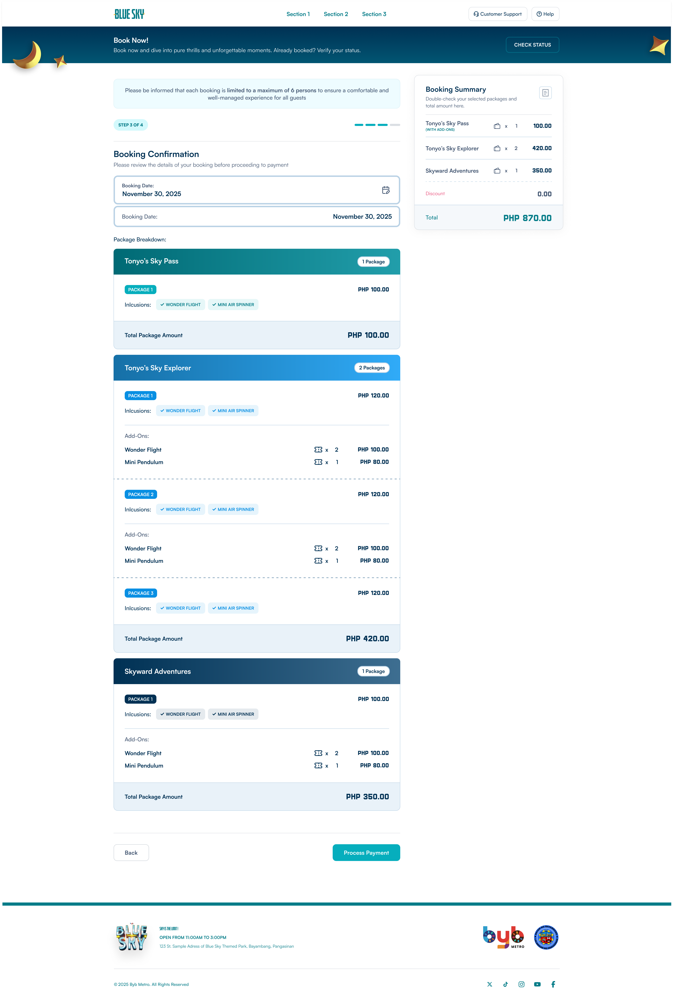
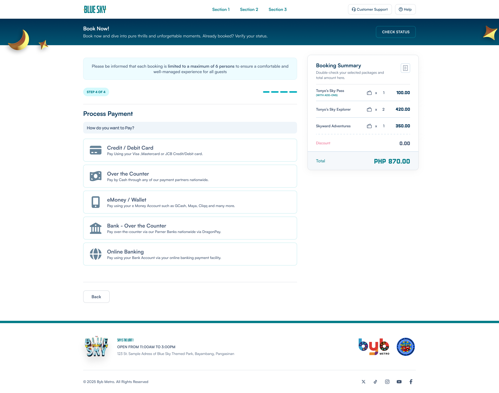

💡Working Add-Ons
  ✅created a pop up modal Add-Ons
  ✅Added functionality on buttons like "+Add-Ons", "Remove this package", "Add Same Package"
  ✅Synced the price with packages/tickets 
  
💡✅"Remove this package" reset count to 0 and remove it from BookingSummary
💡✅Booking Summary displaying "(WTIH ADD-ONS) if added add-ons
💡✅change animation for step number and step icon do not include to current animation
💡✅"Add Same Package" should also include add-on package

💡STEP 1 required inputs should not be proceeding to step 2 if empty

💡imrpove design

💡step indicator add animation/transition

💡create a API version of BookingStep2Local.tsx

💡create Step3, Step4 placeholders

